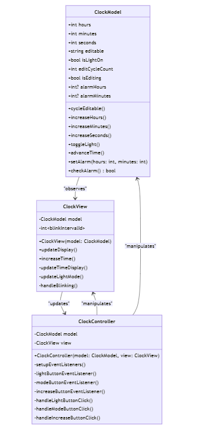

# Clock Application - README

## Table of Contents
1. [Part A - Create a Watch](#part-a---create-a-watch)
2. [Part B - Extend Your Watch](#part-b---extend-your-watch)
3. [Part C - Further Extend Your Watch](#part-c---further-extend-your-watch)

---

## Part A - Create a Watch
-For this part, my main goal was to achieve the following: 
### Functional Requirements
- **Displaying the time**: 
  - The clock displays the current local time in `hh:mm:ss` format, updating every second.
  - Single digit hours, minutes, and seconds are displayed with a leading zero.
  
- **Editing the time**: 
  - A mode button allows toggling between hours, minutes, and standard display.
  - Hours and minutes can be edited while the clock continues to run.

- **UI Editing**: 
  - A light button toggles the background color between yellow and white.

### Technical Requirements
- **Languages**: TypeScript (vanilla).
- **Architecture**: MVC pattern with `ClockModel`, `ClockView`, and `ClockController`.

### UML Class Diagram for Part A

### Result - UI for Part A

---

## Part B - Extend Your Watch
-As for this part, I did a major refactoring, creating the HomePage template, controller and view. 
This was importatnt to reduce the responsability of the clock view/controller as new functionnalities were added (buttons to the clock). 
### Functional Requirements
- **Adding New Clocks**: 
  - A button allows adding new clocks, each synchronized and displaying the local time.
  - Timezone selection is available for each new clock.(UCT default)
  
- **Editing a Clock**:
  - Toggle between AM/PM and 24-hour format.
  - Reset time while keeping the clock settings and timezone, uppon click on a reset button.
  
- **Managing Clocks**: 
  - Each clock can be removed uppon click on a delete button. 

### UML Class Diagram for Part B

### Result - UI for Part B

---

## Part C - Further Extend Your Watch
In this part I refactored the code again, adding new utility classes besides the resuired Matrix3x3. This was important to reduce again the responsability for the clock view/controller. This part was also marked by introducing a new display mode for the clock: the analog mode.
***I still have a little problem with display, when a clock is created for teh first time(digital mode is default), the clock hands appear. However, uppon switching mode to analog and then switching back to digital, the clock hands disappear(normal behaviour). I am still working on fixing this little issue :)
  
### Functional Requirements
- **Matrix Transformations**: 
  - Utility functions allow defining and transforming 3x3 matrices.
  - (extra)ClockUtilities: to allow retreiving the hours, minutes and seconds more efficiently. 
  - (extra)DisplayUtilities: to manage display toggling between analog and digital mode.
  - Apply translation, rotation, and scaling to points.

- **New Clock Type (Analog)**: 
  - An option to switch to an analog clock displaying hours, minutes, and seconds hands.
  - Animations are powered by matrix transformations not css API. 

### UML Class Diagram for Part C

### Result - UI for Part C

